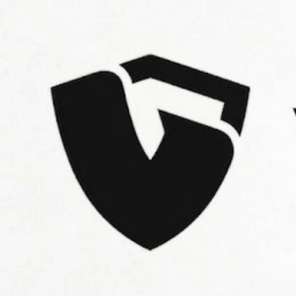

 
VeilPay
Private by Default. Multi-Chain by Design.
Private crypto payments & anonymous donations — stealth payments across 7+ chains.

🌐 Website · 📖 Docs · 𝕏 Twitter · 💬 Discord · ✈️ Telegram

 

Overview
VeilPay is a next-generation private crypto payments platform that combines zero-knowledge proofs, stealth addresses, and multi-chain architecture to deliver fully private transactions. Send and receive payments without revealing sender, receiver, or amount — across Ethereum, Solana, Stellar, and more.

VeilPay is designed for users who demand financial privacy without sacrificing speed, usability, or multi-chain access.

"Take back your financial privacy. Join the waitlist today to experience the fastest, most secure crypto vault on the planet." — veilpayapp.com

<picture> <source media="(prefers-color-scheme: dark)" srcset="assets/veilpay-mockup-dark.webp"> <source media="(prefers-color-scheme: light)" srcset="assets/veilpay-mockup-light.webp">  </picture>
Features
-Privacy-First Transactions

Feature	Description
Zero-Knowledge Proofs	Prove a payment is valid without revealing sender, receiver, or amount. Every transaction is cryptographically private.
Stealth Addresses	EIP-5564 dual-key stealth addresses generate a fresh one-time address per transaction, breaking on-chain linkability across Stellar, EVM, and Solana.
Encrypted Notes	Attach encrypted metadata to transactions that only the intended recipient can decrypt.

-Multi-Chain Support
Chain	Type	Status
Ethereum	EVM L1	✅ Supported
Base	EVM L2	✅ Supported
Arbitrum	EVM L2	✅ Supported
Polygon	EVM L2	✅ Supported
Solana	Non-EVM	✅ Supported
Stellar	Non-EVM	✅ Supported

Supported Assets            

Send and receive privacy-native tokens alongside major chains:

Monero (XMR) — The gold standard in private digital currency
Zcash (ZEC) — Selective disclosure with zk-SNARKs
Midnight — Cardano's privacy-focused sidechain
Stellar Private Payments — Native privacy layer on StellarConsumer App
Unified Vault — One wallet for all your private and public assets
Fiat Ramps — On/off-ramp between fiat and crypto seamlessly
WalletConnect — Connect to dApps with privacy-preserving session management
Send / Receive Flows — Intuitive UX for private payments
Anonymous Donations — Donate privately without exposing your wallet history

Architecture text

Veilpay/
├── api/                # Serverless API routes (Vercel)
├── public/             # Static assets & images
├── scripts/            # Build & utility scripts
├── src/                # Application source code
│   ├── components/     # Reusable UI components
│   ├── pages/          # Route-level page components
│   ├── hooks/          # Custom React hooks
│   └── lib/            # Utilities & helpers
└── veilpay-docs/       # Comprehensive documentation
    ├── architecture/   # Protocol overview & design docs
    ├── chains/         # Per-chain integration guides
    ├── consumer-app/   # App feature documentation
    ├── getting-started/ # Quickstart & setup guides
    ├── privacy/        # ZK proofs, stealth addresses, encrypted notes
    └── security/       # API hardening & secrets management
    
Tech Stack
Layer	Technology
Framework	React 19 + TypeScript 6
Build Tool	Vite 8
Styling	Tailwind CSS 4
Animations	Framer Motion, GSAP
3D Graphics	Three.js (React Three Fiber)
Routing	React Router DOM 7
Icons	Lucide React, Radix UI Icons
Backend	Vercel Serverless Functions
Database	PostgreSQL + Redis
Testing	Vitest

📚 Documentation
Comprehensive documentation lives in veilpay-docs/:
and Veilpayapp.com/docs

Section	Path	Description
Protocol Overview	architecture/	How Veilpay operates and the payment lifecycle
Supported Networks	chains/	Mainnet & testnet details for each chain
Consumer App	consumer-app/	Balances, fiat ramps, send/receive, WalletConnect
Getting Started	getting-started/	Quickstart guide & local development setup
Privacy	privacy/	ZK proofs, stealth addresses, encrypted notes
Security	security/	API hardening, secrets management, security model

 Community & Social
Platform	Link
🌐 Website	www.veilpayapp.com
𝕏 X / Twitter	x.veilpayapp.com
💬 Discord	discord.veilpayapp.com
✈️ Telegram	telegram.veilpayapp.com
📸 Instagram	instagram.veilpayapp.com
💼 LinkedIn	linkedin.veilpayapp.com
📝 Medium	veilpay.medium.com
📰 Blog	veilpayapp.com/blogs

📄 License
This project is licensed under the MIT License — see the LICENSE file for details.

🔐 Private payments. Fully yours.
Join the Waitlist →

⭐ Star this repo to show your support!

